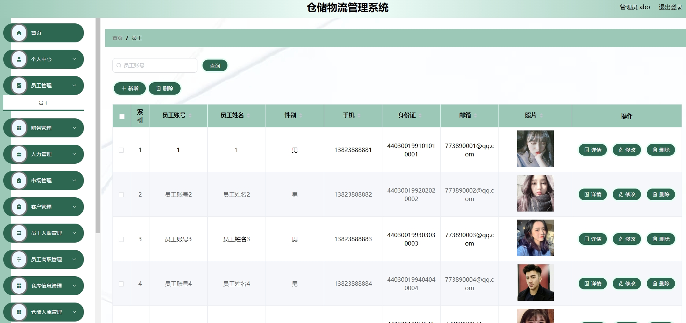
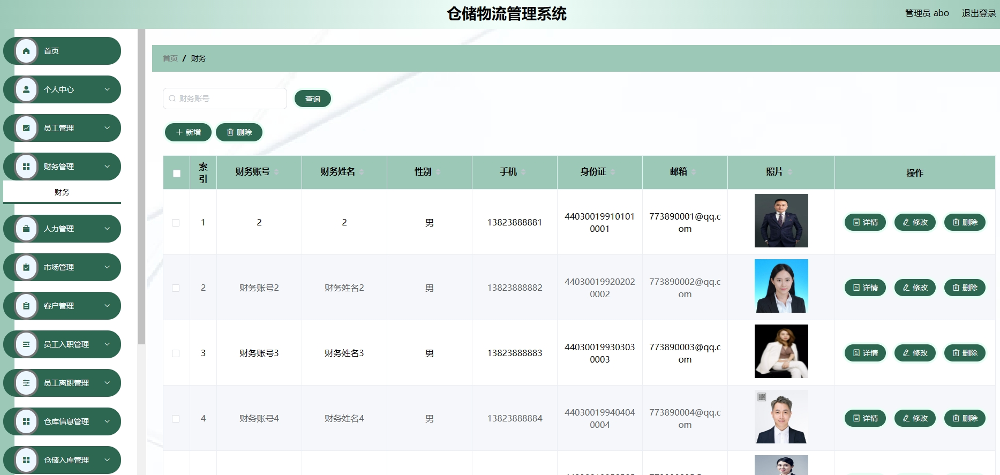
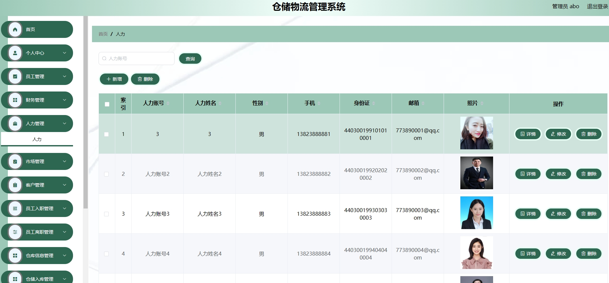
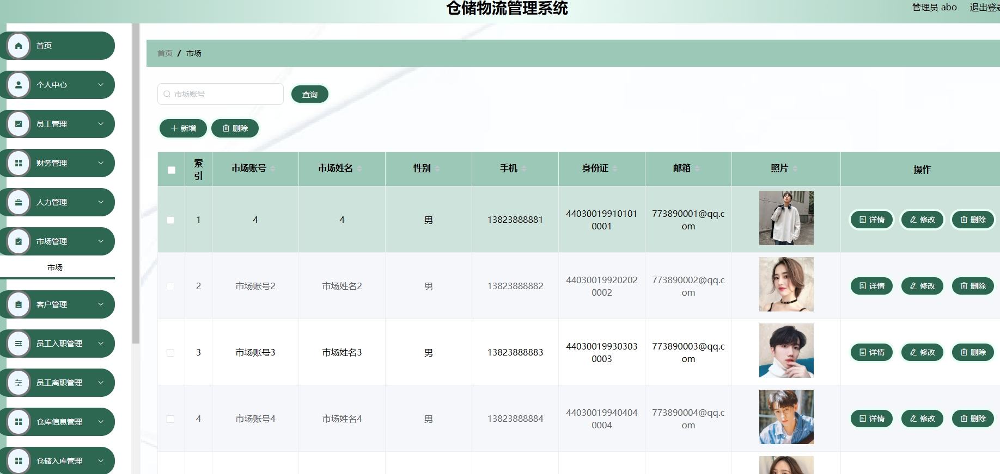
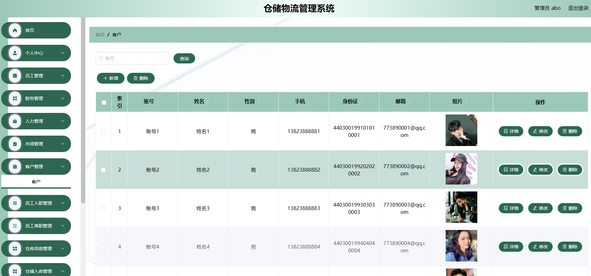
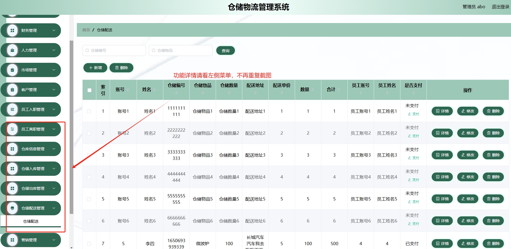
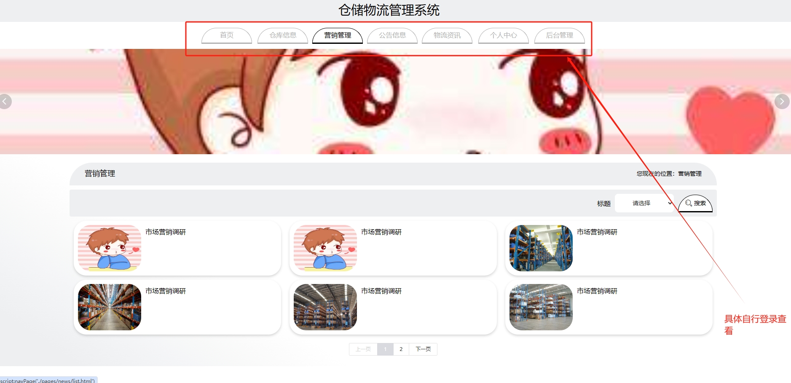
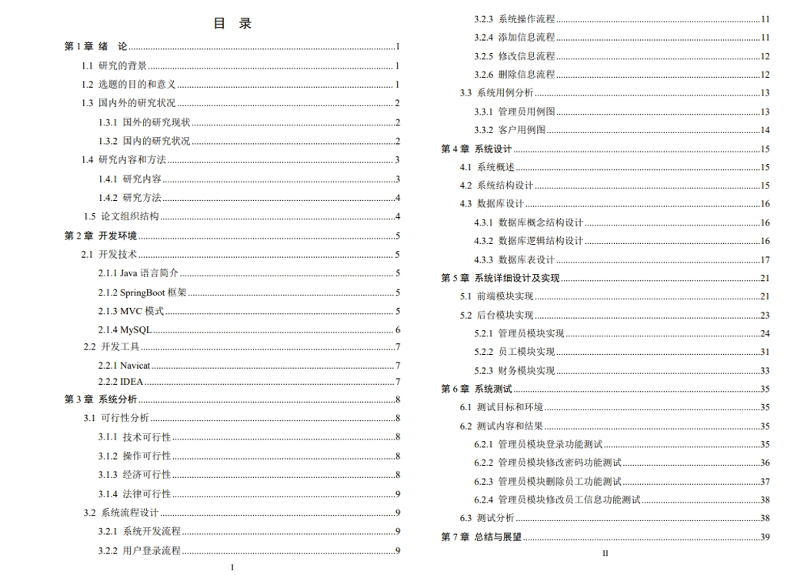

# 1.项目介绍
- 系统角色：管理员、员工、财务、人力、市场、客户
- 功能模块：员工管理、财务管理、人力管理、市场管理、客户管理、仓库信息管理、出入库管理、配送管理、营销管理等
- 技术栈:SpringBoot、vue（后端管理web）、layui（前端门户）等，其他第三方查看pom.xml文件
- 测试环境：idea2024，maven3，mysql5.7，jdk1.8等
# 2.项目部署
- 创建数据库，导入sql
- 通过idea打开项目，根据本地数据库环境配置 src/main/resources/application.yml 11-14行
- 启动项目（vue项目已经放到src/main/resources下，测试直接使用编译后的文件，在dist下，你可以通过vscode或者webstorm打开Vue项目修改后自行编译）
- 后端管理web：http://localhost:8080/springboot6b762/admin/dist/index.html  管理员账号密码：abo/abo，其他角色自行查看表
- 前端：http://localhost:8080/springboot6b762/front/index.html
# 3.项目部分截图

# 4.获取方式
[戳我查看](https://gitee.com/aven999/mall)
